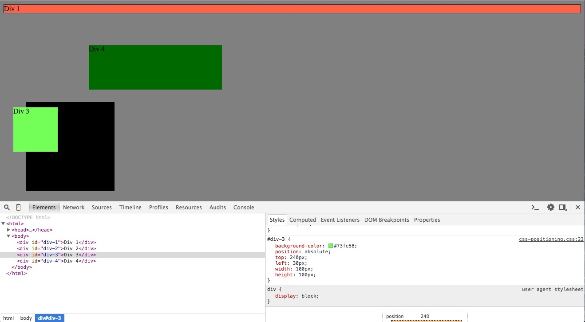
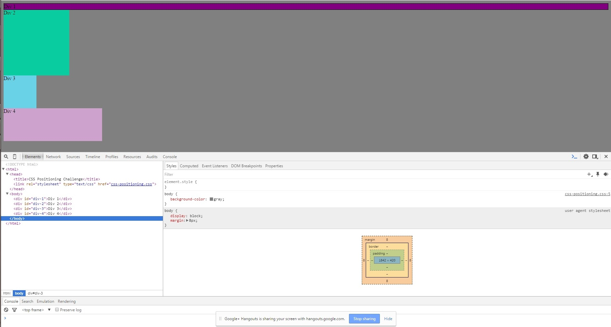
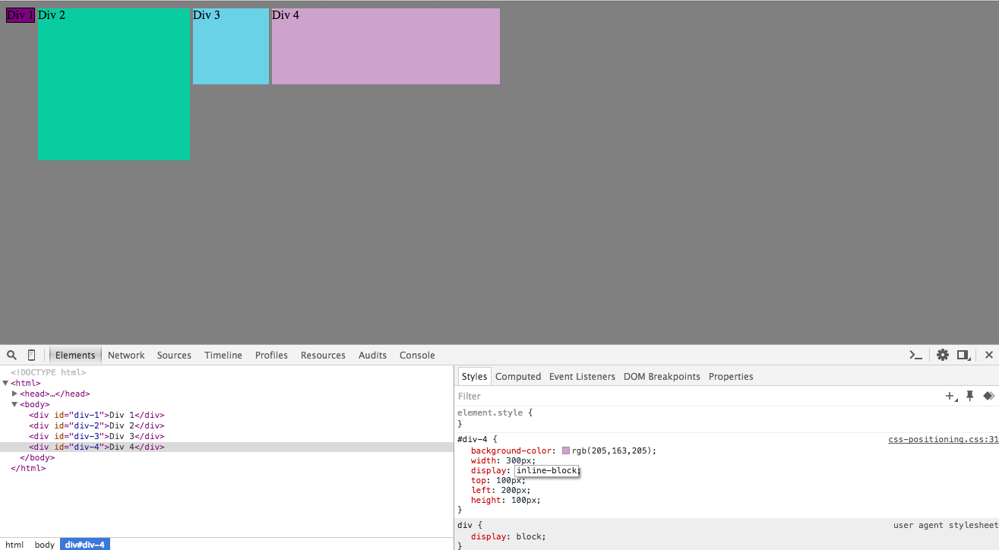
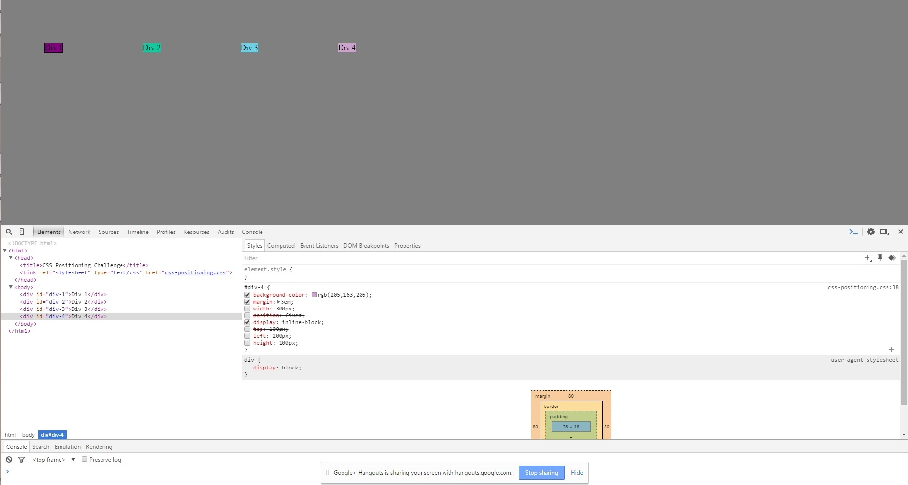
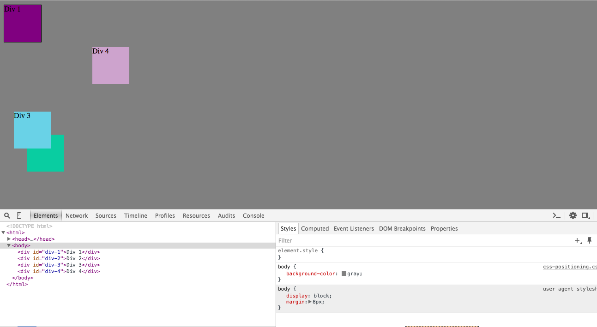
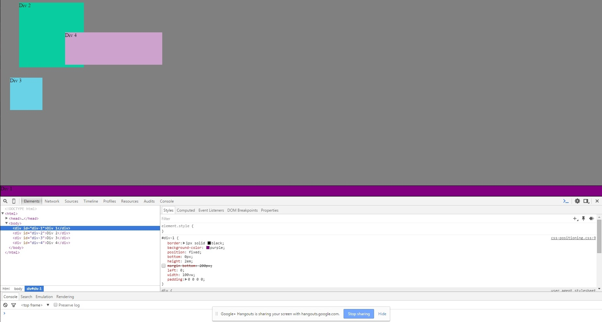
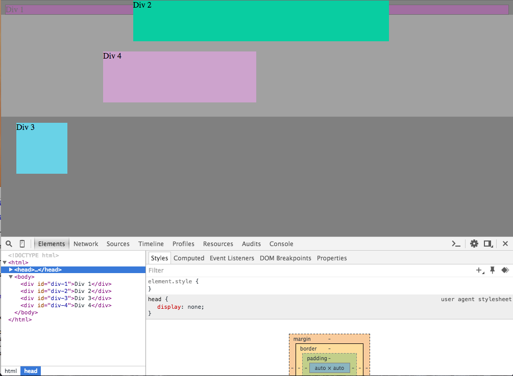
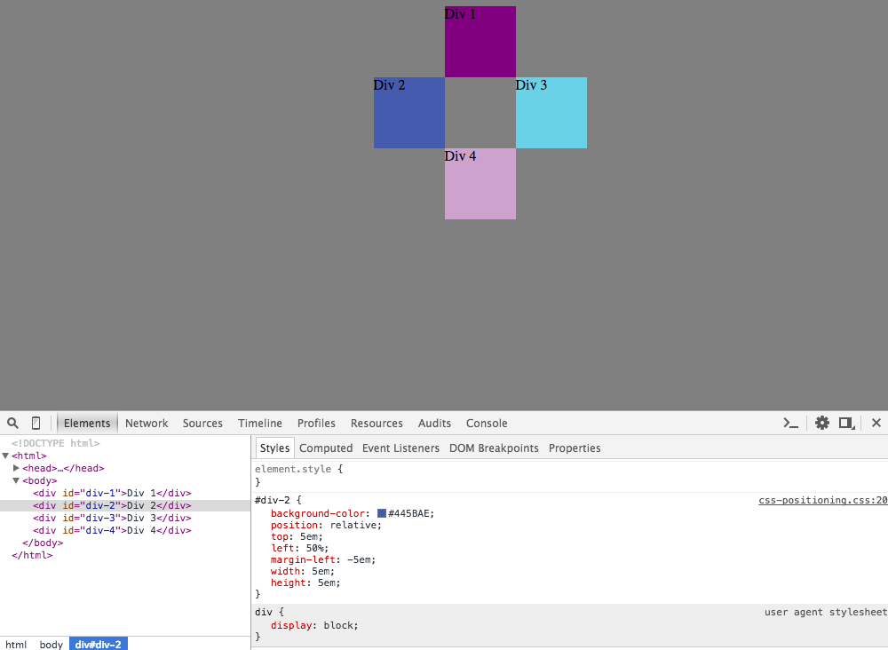

1. Change the Colors

2. Column

3. Row

4. Make Equidistant

5. Squares

6. Footer

7. Header

8. Sidebar

9. Get Creative

**How can you use Chrome's DevTools inspector to help you format or position elements?**

Right-clicking on the page and then selecting 'Inspect element' will bring up the DevTools inspector. Using this inspector, you can see the HTML and CSS. The HTML is on the top left and the CSS is on the top right. You can adjust any properties (position, colors, etc.) and see how they affect the elements in real time. 

**How can you resize elements on the DOM using CSS?**

By adjusting the `width` and `height`, elements can be resized. The `width` and `height` can be adjusted by pixels (px), relative to viewport dimentions (vw or vh), relative to the font size of the element (em), to name a few. 

**What are the differences between Absolute, Fixed, Static, and Relative positioning? Which did you find easiest to use? Which was most difficult?**

`Static` is the default positioning and elements with *static positioning* aren't affected by top, bottom, left, and right properties. 
`Relative` positioning is positioned relative to where it would have been postioned if you didn't edit it's position. Editing the top, bottom, left, and right properties adjutst the element `relative` to where it would have been.
`Fixed` positioning positions the element relative to the viewport. This means that no matter how much you scroll, the element will stay `fixed` in that pace. Editing the top, bottom, left, and right properties will adjust the position of the element relative to the viewport.
`Absolute` positioning means that the element is positioned relative to the it's nearest positioned ancestor. In the absence of a positioned ancestor, the element will be positioned relative to the document body and move along the page with scrolling (as though its position is `fixed`). A positioned element is an element with any position property that isn't `static`.

**What are the differences between Margin, Border, and Padding?**

The padding is the space between the content (text or image) and the border. The border is a line (of whatever thickness and with whatever design - solid, dashed, dots) that surrounds the content. The Margin is the space outside of the border. It helps separate the border of one element from the border of any element next to it. 

**What was your impression of this challenge overall? (love, hate, and why?)**

It was actually not as bad as I thought it would be. I took what I learned about positioning in 3.3 and it really helped make this challenge much easier. It was cool to play around with different layouts and realize that there are multiple ways to get the elements into position (some that followed best practices better than others). After spending a ton of time on the berkshire CSS styling yesterday, I thought this would be another challenge where I spent a lot of time adjusting things little by little. However, when I took a step back to think about why I was using certain positionings and margins and really thought about how every line affected the four elemnts on the page, it was pretty easy to get everything lined up properly.
