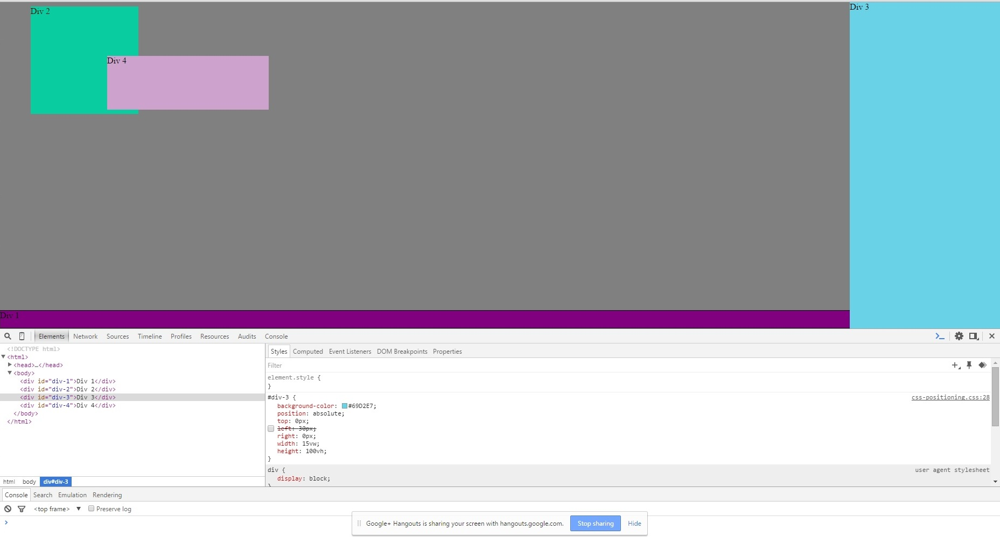

1. Change the Colors

2. Column

3. Row

4. Make Equidistant

5. Squares

6. Footer

7. Header

8. Sidebar

9. Get Creative

**How can you use Chrome's DevTools inspector to help you format or position elements?**

**How can you resize elements on the DOM using CSS?**

**What are the differences between Absolute, Fixed, Static, and Relative positioning? Which did you find easiest to use? Which was most difficult?**

**What are the differences between Margin, Border, and Padding?**

**What was your impression of this challenge overall? (love, hate, and why?)**

