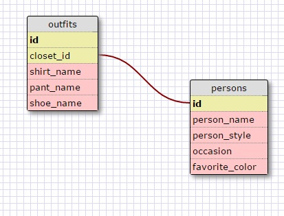

#8.4 - Intro to SQL

###Release 5

1. `SELECT * FROM state;`
2. `SELECT * FROM regions;`
3. ```SELECT state_name, population
FROM states;```
4. ```SELECT state_name, population
FROM states
ORDER BY population DESC;```
5. ```SELECT state_name
FROM states
WHERE region_id=7;```
6. ```SELECT state_name, population_density
FROM states
WHERE population_density > 50
ORDER BY population_density ASC;```
7. ```SELECT state_name
FROM states
WHERE population > 1000000
AND population < 1500000;```
8. ```SELECT state_name, region_id
FROM states
ORDER BY region_id ASC;```
9. ```SELECT region_name
FROM regions
WHERE region_name LIKE '%Central%';```
10. ```SELECT states.state_name, regions.region_name
FROM states
INNER JOIN regions
ON states.region_id=regions.id
ORDER BY states.region_id;```

***
###Release 6



***
###Reflection

**What are databases for?**

Organizing large amounts of related data. For example, a database could be used to organize people and the data linked to those people (names, ages, occupations, etc.). Rather than creating hard to access multi-dimensional hashes, you can put all that information in a database instead.


**What is a one-to-many relationship?**

For example, a single person belongs to an employer and an employer has many people. This is a one to many relationship. 


**What is a primary key? What is a foreign key? How can you determine which is which?**

A primary key a.k.a. a primary keyword is a key in a database that is unique for each record. It is a unique identifier (e.g. a social security number). Primary keys are it's own column in database tables. A foreign key is a field in one table that ids a row of another table. A foreign key is defined in another table and refers to the primary key in the original table.


**How can you select information out of a SQL database? What are some general guidelines for that?**

SELECT is the command used to 'select' certain information from a database. Best practices is to call commands in all capital letters. A semicolon `;` is used to end commands. Commands can be multi-lined commands. 

