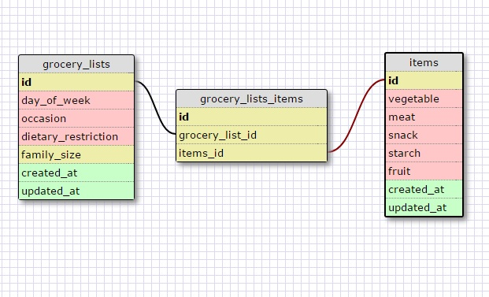

# 8.5 - More Schemas

### Release 2: One to One Schema

It is one to one because there is only one nearest airport to any landmark. It would be totally okay if there was no 'nearest airport' (e.g. in Antartica there might not be an accesible airport on the continent). 

### Release 4: Grocery List

### Release 6: Reflect

**What is a one-to-one database?**

It is when each row in a database table is linked to only one other row in a diffeerent table. E.g. each country has exactly one capital, each person has exactly one Social Security number.

**When would you use a one-to-one database? (Think generally, not in terms of the example you created).**

Perhaps if there is information that isn't often accessed (like a driver's license number for a person), putting it in a separate database would help in more quickly accessing the information in the original databse.

**What is a many-to-many database?**

For a many-to-many database multiple rows in a table can be related to multiple rows in another table. A third table is then used to dictate the relationship between the two databases. For example, a car can have many drivers, and a single driver can own many cars. So you can have a table made up of drivers and a table made up of cars. (A driver can also have no cars or just one car and a car can have no drivers or just one driver.)

**When would you use a many-to-many database? (Think generally, not in terms of the example you created).**

Perhaps when storing data that is kind of related but where the data stored in one table doesn't necessarily apply to the data in the other table. For example, a trait 'paint color' wouldn't apply to a person, but it would apply to a person's car. Just as the trait, gender wouldn't apply to a car, but it would apply to the car's driver.

**What is confusing about database schemas? What makes sense?**

It's mostly just hard to explain in english without examples. It makes sense for now. 
